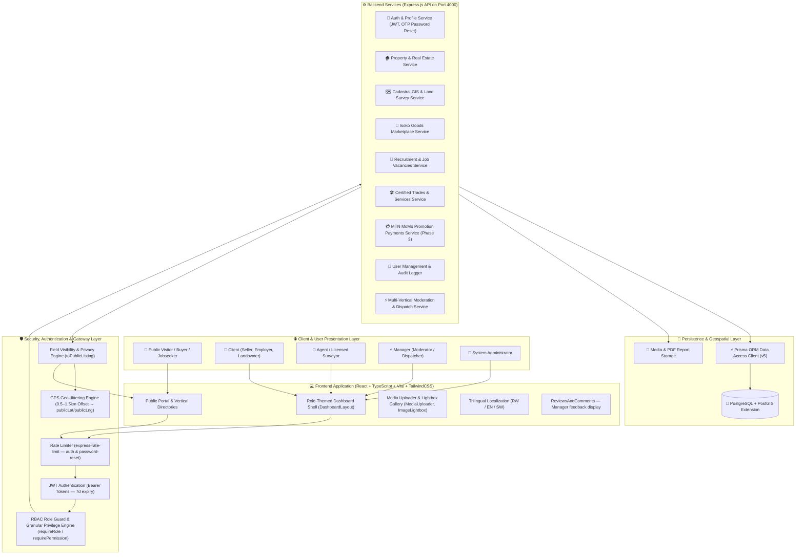
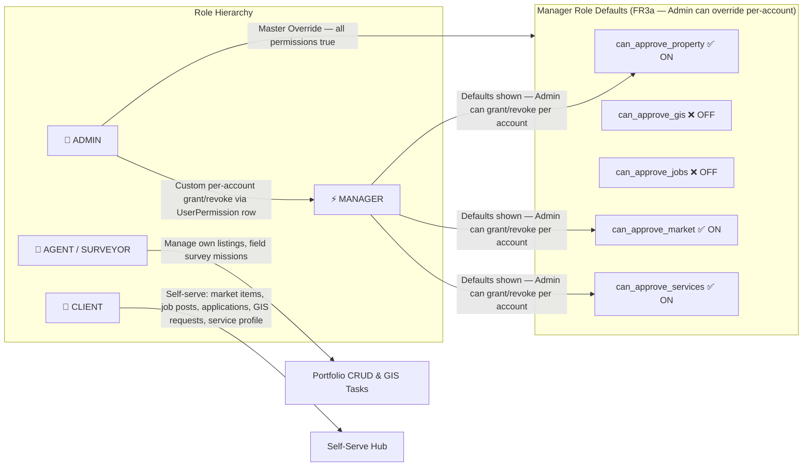
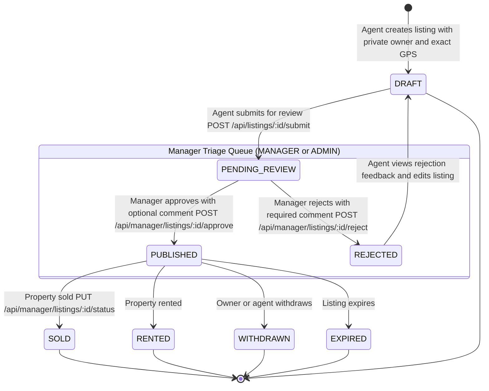
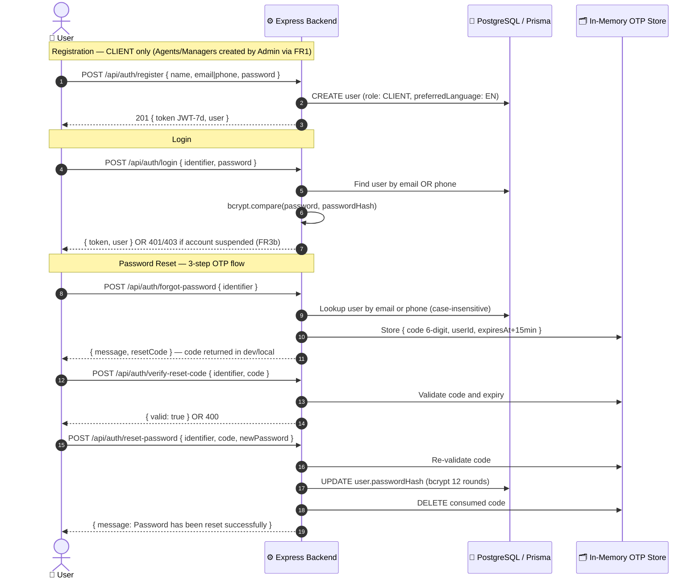
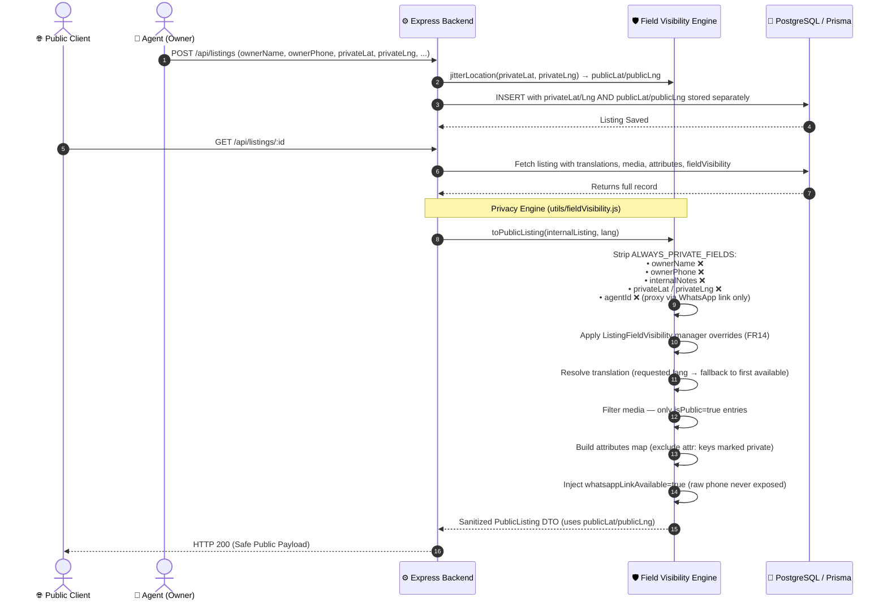
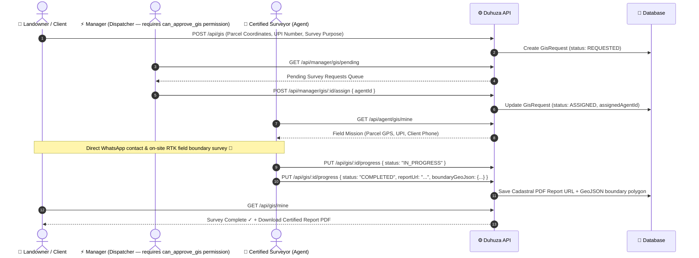
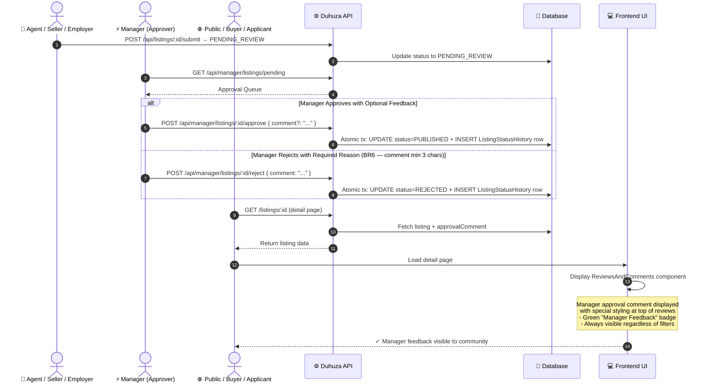

# Duhuza Platform: Workflow & Data Flow Architecture

This document illustrates the end-to-end system architecture, role-based access control (RBAC) lifecycles, data flow security barriers (privacy engine), and multi-vertical workflows across **Duhuza**.

> **Last updated:** 2026-09-01 — reflects current codebase state: auth password-reset OTP flows, full Listing status lifecycle (SOLD/RENTED/WITHDRAWN/EXPIRED), MTN MoMo Payments module, ListingFieldVisibility, WhatsappClickLog, ListingAttribute, public/private GPS dual-field architecture, and full frontend route tree.

---

## 1. High-Level System Architecture

---

## 2. RBAC & Granular Privilege Matrix

The `requirePermission()` middleware checks per-account `UserPermission` overrides first, then falls back to role defaults. Admin always bypasses all permission checks.

> **Note:** Manager defaults for `can_approve_gis` and `can_approve_jobs` are **false** — only ADMIN or a Manager with an explicit `UserPermission` override can action GIS assignments and job approvals.

---

## 3. Real Estate Listing Lifecycle & Moderation Workflow

> Every status transition is logged in `ListingStatusHistory` (who, when, old→new, optional comment) — FR12.

---

## 4. Authentication & Password Reset Flows

---

## 5. Field Visibility & Anti-Scraping Data Flow Engine

This diagram illustrates how **BR3**, **BR8**, **FR13**, and **FR14** protect confidential owner data and exact GPS coordinates from public scraping. Note the **dual-GPS architecture**: `privateLat`/`privateLng` (exact, stored in DB — never serialized publicly) vs `publicLat`/`publicLng` (jittered 0.5–1.5 km, stored and safely served):

---

## 6. Cadastral GIS Land Survey Dispatch Workflow

---

## 7. Manager Approval Feedback Workflow

This diagram shows how managers can provide optional approval comments that are visible to users in the public reviews section:

---

## 9. Multi-Vertical Data Entity Relationship (ERD)

```mermaid
erDiagram
    User ||--o{ Listing : "authors AgentListings"
    User ||--o{ UserPermission : "has AccountPermissions"
    User ||--o{ UserPermission : "grants GrantedByAdmin"
    User ||--o{ ListingStatusHistory : "changes status"
    User ||--o{ GisRequest : "requests ClientGisRequests"
    User ||--o{ GisRequest : "assigned to survey AssignedSurveyor"
    User ||--o{ MarketItem : "sells Seller"
    User ||--o{ Job : "posts Employer"
    User ||--o{ JobApplication : "applies Applicant"
    User ||--o| ServiceProvider : "operates ProviderProfile"
    User ||--o{ Transaction : "pays PayingUser"

    Listing ||--o{ ListingTranslation : "translates"
    Listing ||--o{ ListingMedia : "contains"
    Listing ||--o{ ListingAttribute : "has attributes"
    Listing ||--o{ ListingStatusHistory : "tracks history"
    Listing ||--o{ ListingFieldVisibility : "configures field overrides FR14"
    Listing ||--o{ WhatsappClickLog : "logs contact clicks"

    Job ||--o{ JobApplication : "receives"
    MarketItem ||--o{ MarketItemMedia : "displays"

    User {
        string id PK
        string name
        string email "unique optional"
        string phone "unique optional"
        string passwordHash
        string role "ADMIN | MANAGER | AGENT | CLIENT"
        string preferredLanguage "EN | RW | SW default RW"
        boolean isActive "FR3b Admin can suspend"
        datetime createdAt
        datetime updatedAt
    }

    UserPermission {
        string id PK
        string userId FK
        string permissionKey "e.g. can_approve_property, can_approve_gis"
        string value "true | false parsed in app layer"
        string grantedById FK "Admin who granted the override"
        datetime updatedAt
    }

    Listing {
        string id PK
        string agentId FK
        string category "HOUSE | LAND | VEHICLE | MOTORCYCLE"
        string listingType "SALE | RENT"
        decimal price
        string currency "default RWF"
        float publicLat "jittered — safe to expose"
        float publicLng "jittered — safe to expose"
        string district
        string sector
        string cell
        string village
        float privateLat "CONFIDENTIAL exact GPS"
        float privateLng "CONFIDENTIAL exact GPS"
        string ownerName "CONFIDENTIAL"
        string ownerPhone "CONFIDENTIAL"
        string internalNotes "CONFIDENTIAL"
        string status "DRAFT|PENDING_REVIEW|APPROVED|PUBLISHED|REJECTED|SOLD|RENTED|WITHDRAWN|EXPIRED"
    }

    GisRequest {
        string id PK
        string clientId FK "landowner who made the request"
        string assignedAgentId FK "nullable assigned surveyor"
        float parcelLat
        float parcelLng
        string purpose
        string status "REQUESTED | ASSIGNED | IN_PROGRESS | COMPLETED"
        json boundaryGeoJson "GeoJSON polygon from field survey"
        string reportUrl "Cadastral PDF URL"
        datetime createdAt
        datetime updatedAt
    }

    MarketItem {
        string id PK
        string sellerId FK
        string category
        string title
        decimal price
        string currency
        string status "PENDING_REVIEW | PUBLISHED | REJECTED | SOLD"
        boolean isPromoted "set true only after verified MoMo callback FR43"
        datetime promotedUntil
        string approvalComment "Manager feedback on approval"
    }

    ServiceProvider {
        string id PK
        string userId FK "unique one-to-one with User"
        string category "plumbing, tutoring, transport, tailoring..."
        string description
        string rateInfo "free text e.g. 5000 RWF/hour"
        string coverageDistrict
        string coverageSector
        string status "PENDING_REVIEW | PUBLISHED | REJECTED"
        boolean isPromoted
        datetime promotedUntil
        string approvalComment "Manager approval feedback"
        datetime createdAt
        datetime updatedAt
    }

    Job {
        string id PK
        string employerId FK
        string title
        string description
        string location
        string salaryRange
        datetime deadline
        string status "PENDING_REVIEW | PUBLISHED | REJECTED | CLOSED"
        string approvalComment "Manager approval feedback"
        datetime createdAt
    }

    JobApplication {
        string id PK
        string jobId FK
        string clientId FK
        string cvUrl
        datetime appliedAt
        string status "default submitted"
    }

    MarketItemMedia {
        string id PK
        string marketItemId FK
        string url
        int sortOrder
    }

    ListingAttribute {
        string id PK
        string listingId FK
        string key "e.g. bedrooms engine_cc land_size_sqm"
        string value
    }

    ListingFieldVisibility {
        string id PK
        string listingId FK
        string fieldName "field name or attr:key"
        boolean isPublic "Manager override FR14"
    }

    WhatsappClickLog {
        string id PK
        string listingId FK
        datetime clickedAt
        string clientIpHash "hashed for analytics not raw IP"
    }

    Transaction {
        string id PK
        string userId FK
        string referenceType "LISTING | MARKET_ITEM | SERVICE | JOB"
        string referenceId "id of item being promoted"
        decimal amount
        string currency "default RWF"
        string momoTransactionRef "unique set after MoMo request"
        string status "PENDING | SUCCESSFUL | FAILED"
        datetime initiatedAt
        datetime confirmedAt "set only on verified MoMo callback BR14"
    }
```

---

## 10. Frontend Route Tree & Role-Protected Navigation

```mermaid
graph TD
    Root["/  Layout"]
    Root --> Public["Public Routes no auth required"]
    Root --> Guest["Guest-only Routes redirect if logged in"]
    Root --> Dashboard["/dashboard ProtectedRoute any authenticated user"]

    Public --> Home["/  HomePage"]
    Public --> Listings["/listings  ListingsPage"]
    Public --> ListingDetail["/listings/:id  ListingDetailPage"]
    Public --> GisPublic["/gis  GisPage info and request"]
    Public --> Market["/market  MarketPage"]
    Public --> MarketDetail["/market/:id  MarketDetailPage"]
    Public --> Services["/services  ServicesPage"]
    Public --> Jobs["/jobs  JobsPage"]
    Public --> JobDetail["/jobs/:id  JobDetailPage"]

    Guest --> Login["/login  LoginPage"]
    Guest --> Register["/register  RegisterPage"]
    Guest --> ForgotPwd["/forgot-password  ForgotPasswordPage OTP flow"]
    Guest --> ResetPwd["/reset-password  ForgotPasswordPage reused"]

    Dashboard --> Profile["/dashboard/profile  ProfilePage"]
    Dashboard --> AgentRoutes["AGENT only /dashboard/agent"]
    Dashboard --> ManagerRoutes["MANAGER or ADMIN /dashboard/manager"]
    Dashboard --> ClientRoutes["CLIENT only /dashboard/client"]
    Dashboard --> AdminRoutes["ADMIN only /dashboard/admin"]

    AgentRoutes --> AgentDash["AgentDashboard"]
    AgentRoutes --> AgentListings["AgentListingsPage"]
    AgentRoutes --> AgentListingNew["AgentListingFormPage create"]
    AgentRoutes --> AgentListingEdit["AgentListingFormPage edit id"]
    AgentRoutes --> AgentGis["AgentGisPage assigned missions"]

    ManagerRoutes --> ManagerDash["ManagerDashboard"]
    ManagerRoutes --> ManagerListings["ManagerListingsPage property moderation"]
    ManagerRoutes --> ManagerMarket["ManagerMarketPage Isoko moderation"]
    ManagerRoutes --> ManagerServices["ManagerServicesPage services moderation"]
    ManagerRoutes --> ManagerGis["ManagerGisPage GIS assignment"]
    ManagerRoutes --> ManagerJobs["ManagerJobsPage job moderation"]

    ClientRoutes --> ClientDash["ClientDashboard"]
    ClientRoutes --> ClientMarket["ClientMarketPage own items"]
    ClientRoutes --> ClientMarketNew["ClientMarketFormPage create item"]
    ClientRoutes --> ClientJobs["ClientJobsPage own posts"]
    ClientRoutes --> ClientJobNew["ClientJobFormPage create post"]
    ClientRoutes --> ClientApps["ClientApplicationsPage"]
    ClientRoutes --> ClientGis["ClientGisPage GIS requests"]
    ClientRoutes --> ClientService["ClientServicePage own service profile"]

    AdminRoutes --> AdminDash["AdminDashboard"]
    AdminRoutes --> AdminUsers["AdminUsersPage all users and permissions"]
    AdminRoutes --> AdminCreateUser["AdminCreateUserPage create Agent Manager Admin"]
```

---

## 11. API Endpoint Registry

| Module | Method | Path | Auth | Permission |
|---|---|---|---|---|
| **Auth** | POST | `/api/auth/register` | — | — |
| | POST | `/api/auth/login` | — | rate-limited |
| | POST | `/api/auth/forgot-password` | — | rate-limited |
| | POST | `/api/auth/verify-reset-code` | — | rate-limited |
| | POST | `/api/auth/reset-password` | — | rate-limited |
| | GET | `/api/auth/profile` | JWT | — |
| | PUT | `/api/auth/profile` | JWT | — |
| | POST | `/api/auth/change-password` | JWT | — |
| **Listings** | GET | `/api/listings` | — | public |
| | POST | `/api/listings` | JWT | AGENT |
| | GET | `/api/listings/:id` | — | public sanitized |
| | PUT | `/api/listings/:id` | JWT | owner/AGENT |
| | POST | `/api/listings/:id/submit` | JWT | AGENT |
| | GET | `/api/listings/:id/whatsapp-link` | — | — |
| **Manager – Listings** | GET | `/api/manager/listings/pending` | JWT | can_approve_property |
| | POST | `/api/manager/listings/:id/approve` | JWT | can_approve_property |
| | POST | `/api/manager/listings/:id/reject` | JWT | can_approve_property |
| | PUT | `/api/manager/listings/:id/status` | JWT | can_approve_property |
| | POST | `/api/manager/listings/:id/reassign` | JWT | can_approve_property |
| | PUT | `/api/manager/listings/:id` | JWT | can_approve_property |
| **Manager – Market** | GET | `/api/manager/market/pending` | JWT | can_approve_market |
| | POST | `/api/manager/market/:id/approve` | JWT | can_approve_market |
| | POST | `/api/manager/market/:id/reject` | JWT | can_approve_market |
| **Manager – Services** | GET | `/api/manager/services/pending` | JWT | can_approve_services |
| | POST | `/api/manager/services/:id/approve` | JWT | can_approve_services |
| | POST | `/api/manager/services/:id/reject` | JWT | can_approve_services |
| **Manager – GIS** | GET | `/api/manager/gis/pending` | JWT | can_approve_gis |
| | POST | `/api/manager/gis/:id/assign` | JWT | can_approve_gis |
| **Manager – Jobs** | GET | `/api/manager/jobs/pending` | JWT | can_approve_jobs |
| | POST | `/api/manager/jobs/:id/approve` | JWT | can_approve_jobs |
| | POST | `/api/manager/jobs/:id/reject` | JWT | can_approve_jobs |
| **GIS** | POST | `/api/gis` | JWT | CLIENT |
| | GET | `/api/gis/mine` | JWT | CLIENT |
| | GET | `/api/agent/gis/mine` | JWT | AGENT |
| | PUT | `/api/gis/:id/progress` | JWT | AGENT |
| **Market** | GET | `/api/market` | — | public |
| | POST | `/api/market` | JWT | CLIENT |
| | GET/PUT/DELETE | `/api/market/:id` | JWT | owner |
| **Services** | GET | `/api/services` | — | public |
| | POST | `/api/services` | JWT | CLIENT |
| | GET/PUT/DELETE | `/api/services/:id` | JWT | owner |
| **Jobs** | GET | `/api/jobs` | — | public |
| | POST | `/api/jobs` | JWT | CLIENT |
| | GET/PUT/DELETE | `/api/jobs/:id` | JWT | owner |
| | POST | `/api/jobs/:id/apply` | JWT | CLIENT |
| **Payments** | POST | `/api/payments/momo/callback` | MTN sig BR14 | — |
| | POST | `/api/payments/momo/request` | JWT | — |
| | GET | `/api/payments/mine` | JWT | — |
| **Admin** | GET | `/api/admin/users` | JWT | ADMIN |
| | POST | `/api/admin/users` | JWT | ADMIN |
| | PUT | `/api/admin/users/:id/permissions` | JWT | ADMIN |
| | PUT | `/api/admin/users/:id/status` | JWT | ADMIN |
