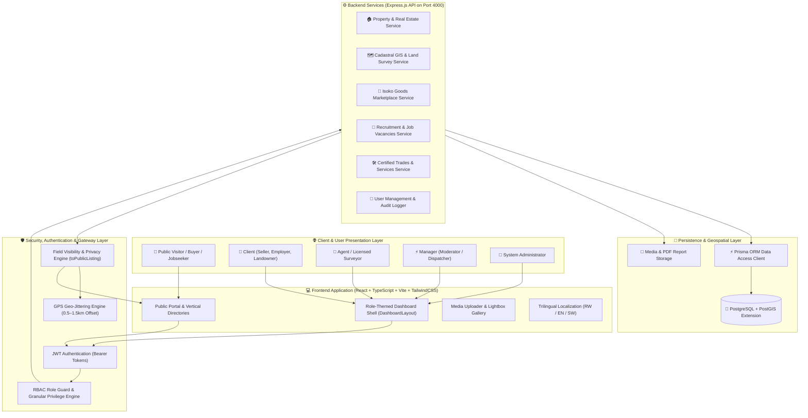
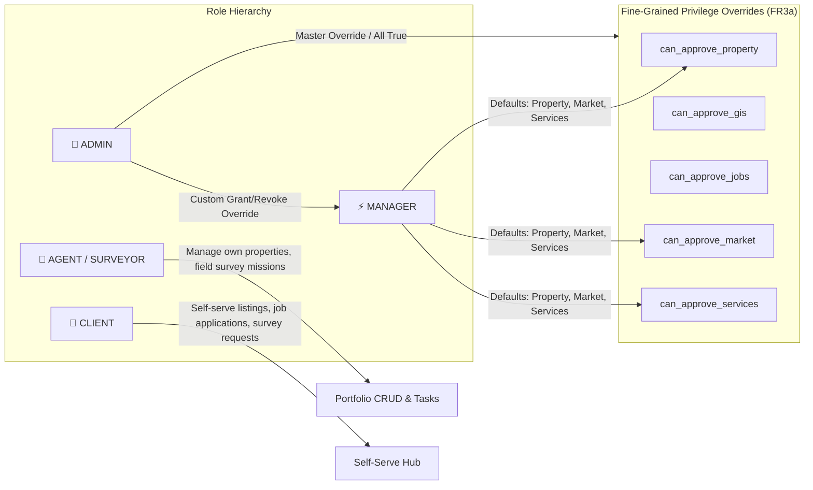
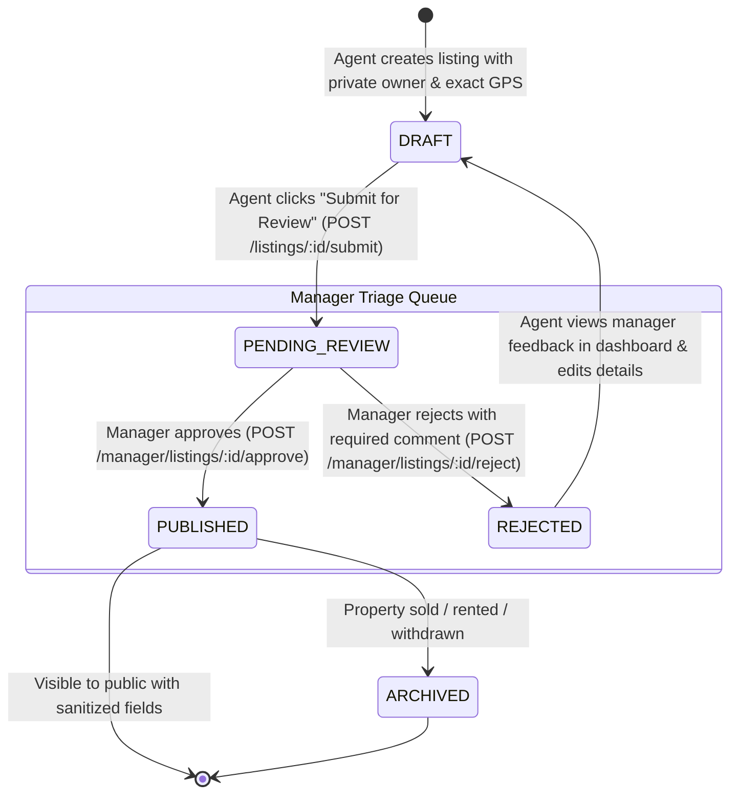
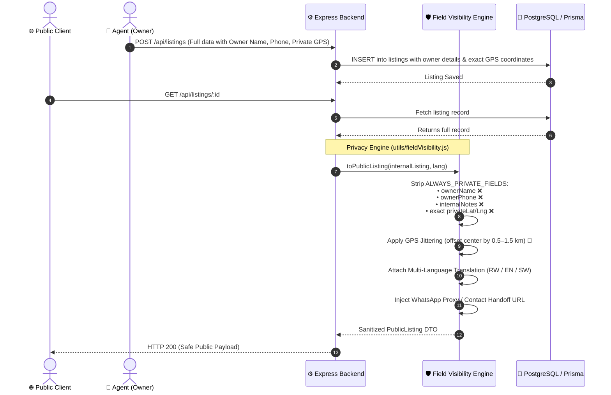
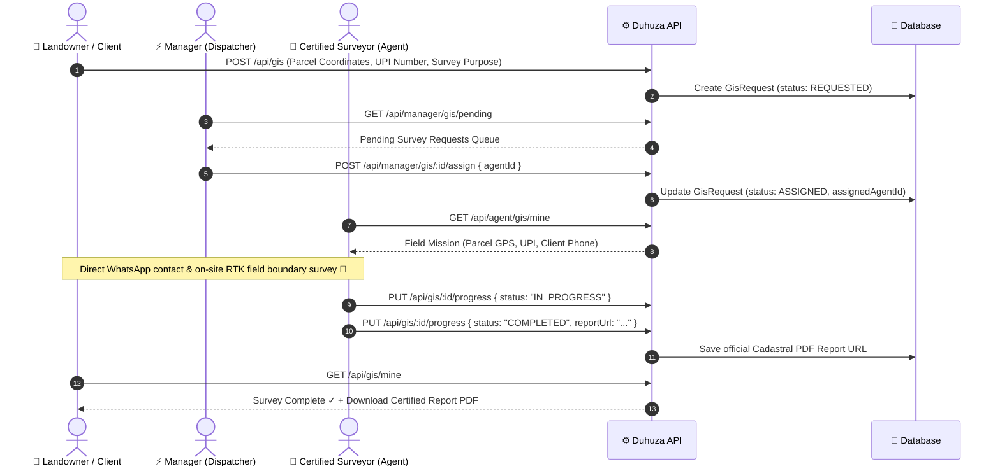
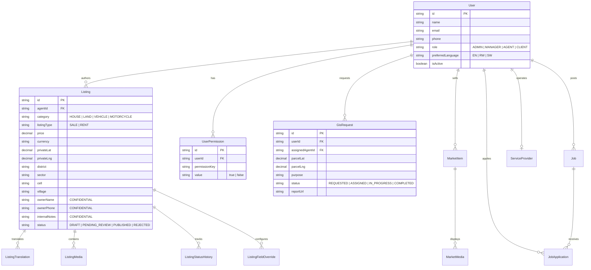

# Duhuza Platform: Workflow & Data Flow Architecture

This document illustrates the end-to-end system architecture, role-based access control (RBAC) lifecycles, data flow security barriers (privacy engine), and multi-vertical workflows across **Duhuza**.

---

## 1. High-Level System Architecture

---

## 2. RBAC & Granular Privilege Matrix

---

## 3. Real Estate Listing Lifecycle & Moderation Workflow

---

## 4. Field Visibility & Anti-Scraping Data Flow Engine

This diagram illustrates how **BR3**, **BR8**, **FR13**, and **FR14** protect confidential owner data and exact GPS coordinates from public scraping:

---

## 5. Cadastral GIS Land Survey Dispatch Workflow

---

## 6. Multi-Vertical Data Entity Relationship (ERD)

